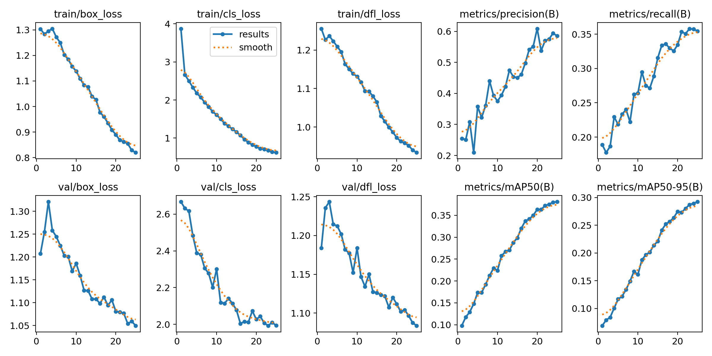
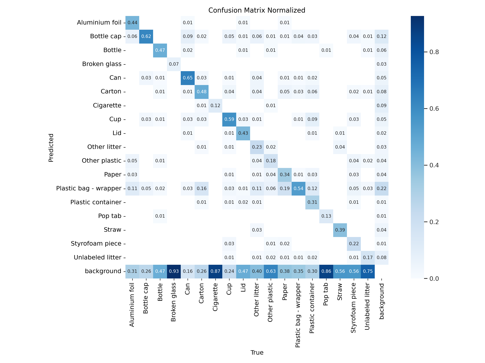

# Smart Grip Car v1.1

STM32F103 기반 이동·그리퍼 제어에 Raspberry Pi 카메라 스트리밍, 웹 원격 제어, YOLOv8 폐기물 탐지 모델을 결합한 임베디드 AI 로봇 프로젝트입니다.

> 취업 포트폴리오용 공개 저장소입니다. 전체 원본 대신 시스템 구성과 핵심 구현을 이해할 수 있는 코드 및 실험 결과를 선별해 공개합니다.

## 프로젝트 개요

- 개발 기간: 2026.03.25 ~ 2026.04.01
- MCU: STM32F103
- SBC: Raspberry Pi 4
- 주요 기술: C, Python, Node.js, Flask, OpenCV, YOLOv8
- 통신 및 제어: UART, I2C, PWM, ADC

Smart Grip Car v1.0의 STM32 차량·그리퍼 제어 코드를 기반으로 v1.1에서 Raspberry Pi, 웹 UI, 카메라 스트리밍과 객체 탐지 모델을 추가했습니다.

## 시스템 구성

```text
Browser
  │ HTTP
  ▼
Node.js Web Controller ── Serial/UART ── STM32F103
  │                                      ├─ DC motors
  ├─ sensor/status UI                    ├─ servo gripper
  └─ Flask MJPEG stream                  ├─ ultrasonic sensor
           ▲                             └─ light sensor / LED
           │ USB camera
       Raspberry Pi 4

TACO dataset ── Colab / YOLOv8s training ── best.pt
```

공개 코드에서는 카메라 스트리밍, 웹 기반 UART 제어, STM32 하드웨어 제어 및 YOLO 학습 결과를 각각 확인할 수 있습니다. 실제 장치별 포트와 네트워크 설정은 환경에 맞게 변경해야 합니다.

## 주요 기능

### STM32 제어

- 전진·후진·좌우·대각선 이동
- PWM 기반 양쪽 서보 그리퍼 제어
- 초음파 거리 측정과 장애물 대응
- 조도 센서 기반 상태 처리
- UART 명령 수신 및 센서 상태 전송
- I2C LCD 상태 표시

### Raspberry Pi 및 웹 UI

- Node.js/Express 기반 제어 화면
- 시리얼 포트 자동 탐색 및 연결
- 차량·그리퍼 명령 전송
- 센서 값과 연결 상태 모니터링
- Flask/OpenCV 기반 MJPEG 카메라 스트리밍

### YOLOv8 객체 탐지

- TACO 기반 18개 폐기물 클래스
- YOLOv8s 사전 학습 가중치 사용
- Google Colab Tesla T4에서 25 epochs 학습
- 학습/검증/테스트 분할: 4,200 / 1,704 / 100장

## 모델 성능

검증 세트 1,704장 기준 대표 성능입니다.

| Metric | Value |
|---|---:|
| Precision | 0.583 |
| Recall | 0.355 |
| mAP@0.5 | 0.381 |
| mAP@0.5:0.95 | 0.292 |

100장 테스트 세트에서는 Precision 0.841, Recall 0.581, mAP@0.5 0.652, mAP@0.5:0.95 0.514를 기록했습니다. 테스트 세트가 작으므로 저장소와 발표 자료의 대표 수치는 검증 결과를 사용합니다.

<p align="center">
  
</p>

<p align="center">
  
</p>

## 저장소 구조

```text
.
├─ firmware/             # STM32CubeIDE 핵심 펌웨어
├─ raspberry-pi/         # Node.js 제어 서버와 Flask 카메라 서버
├─ bridge/               # 시리얼 브리지 예제
├─ training/             # YOLOv8 학습 코드와 데이터 설정 예시
├─ assets/results/       # 학습 곡선과 평가 그래프
├─ models/               # 모델 배포 안내
└─ docs/                 # 프로젝트 발표 자료
```

## 실행 방법

### 1. Raspberry Pi 웹 컨트롤러

```bash
cd raspberry-pi
npm install
cp config.example.json config.json
npm start
```

기본 웹 서버는 `http://<Raspberry-Pi-IP>:3000`, 카메라 스트림은 `http://<Raspberry-Pi-IP>:5000/video_feed`에서 확인할 수 있습니다.

### 2. YOLOv8 학습

```bash
pip install ultralytics==8.2.103 pyyaml
python training/train_yolov8.py --data /path/to/data.yaml
```

데이터셋 디렉터리는 저장소에 포함하지 않습니다. `training/data.example.yaml`을 참고해 로컬 경로를 지정하세요.

## 문제 해결 경험

- STM32와 Raspberry Pi 사이의 UART 명령·상태 메시지 형식을 통일했습니다.
- 웹 UI에서 포트 탐색, 재연결, 상태 갱신을 처리해 장치 교체에 대응했습니다.
- TACO 데이터의 클래스 불균형과 실제 촬영 환경 차이를 확인하고, 검증·테스트 지표를 분리해 과도한 성능 해석을 피했습니다.
- Colab의 NumPy/YOLOv8 바이너리 호환 문제를 버전 고정과 런타임 재시작으로 해결했습니다.

## 공개 범위와 데이터 출처

- TACO 파생 데이터셋 원본과 학습 이미지/라벨은 용량 및 재배포 관리를 위해 포함하지 않습니다.
- 사용한 Roboflow 데이터셋: `TACO` project version 3, CC BY 4.0
- 학습 가중치 `best.pt`는 GitHub Release로 제공합니다.
- 하드웨어 연결 정보와 개인 환경의 시리얼 포트 값은 예시 설정으로 대체했습니다.

## 문서

- [프로젝트 발표 자료](docs/Smart-Grip-Car-v1.1.pdf)
- [모델 사용 안내](models/README.md)

## 개발자

임청수 · Embedded Firmware & Robotics Engineer  
[GitHub](https://github.com/koonie404)
